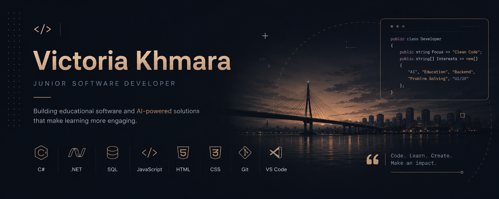

  

<h1 align="center">
Hi, I'm Victoria Khmara 👋
</h1>

Software Developer • Backend • AI • Desktop Applications

Building educational software and exploring artificial intelligence.

---

# 💻 About

I'm a software developer passionate about creating applications that combine clean architecture, modern technologies and intuitive user experience.

Currently, my primary interests include:

- Backend Development
- Artificial Intelligence
- Desktop Applications
- Database Design
- Educational Software

---

# 🚀 Current Project

## 🎮 SpeedTypingNovel

AI-powered educational visual novel for learning touch typing.

### Main features

- Story-driven gameplay
- AI-generated educational feedback
- SQLite database
- Local LLM via Ollama
- Statistics & Progress Tracking
- Chapter Unlock System

---

# 🛠 Tech Stack

### Languages

### Frameworks & Engines

### Databases

### Tools

---

# 📊 GitHub Statistics

---

# 📈 Contribution Graph

---

# 📌 Goals for 2026

- Build production-ready backend applications
- Improve software architecture skills
- Learn ASP.NET Core more deeply
- Explore AI integration in desktop applications
- Publish new open-source projects

---

# 📫 Contact

---

⭐ Thanks for visiting my profile!

